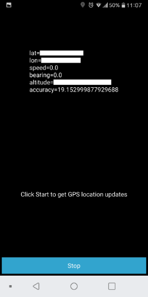

# KivyCamAR
Prototypic Examples for Android AR Apps with Kivy

## Overview
This repository contains several Kivy Apps. They are only prototyic Test Apps with some single functionalities. 
The Goal was to test the Framework Kivy with regards to an Augmented Realtiy App, which maybe will be done in the future.
For others it may be a collection for their start with the Kivy Framework.

With exception to the last App, all other Apps are build successive.

## 01 Simplest Kivy App
This App was used to get the Buildprocess running. It has only some simple features, like a Scatterbox and a Textfield.

**Sources:**
- https://www.youtube.com/watch?v=2Gc8iYJQ_qk
- https://github.com/inclement/kivycrashcourse/tree/master/video8-lets_fix_some_bugs

## 02 Android Toast App
Enhances App 01 with an Android Toast. 

**Sources:**
- https://github.com/kivy/plyer/tree/master/examples/notification
- https://plyer.readthedocs.io/en/latest/index.html#plyer.facades.Notification

## 03 Simple Camera App
Simple Camera with working Permission on Android SDK 23+.

**Source:**
- https://kivy.org/doc/stable/examples/gen__camera__main__py.html

## 04a Kivy CV
Camera with OpenCV and Face Recognition.

**Source:**
- https://github.com/Skalextric/kivy_cv

## 04b OpenCV Camera App
Camera with simple OpenCV-Filter: Grayscale, Invert and Edges.

**Source:**
- https://github.com/Skalextric/kivy_cv

## 05 Gravity Camera App
Camera with overlayed Horizon, based on Gravity Sensor Data. 

**Source:**
- https://github.com/kivy/plyer/tree/master/examples/gravity

## 06 Compass Camera App
Camera with Horizon and Compass Display (South). The Compass works unreliable.

**Source:**
- https://github.com/kivy/plyer/tree/master/examples/compass

## 07 Sensor Camera App
Accelerometer and Gyroscope added.

**Sources:**
- https://github.com/kivy/plyer/tree/master/examples/accelerometer
- https://github.com/kivy/plyer/tree/master/examples/gyroscope

## 08 Plyer GPS Example
GPS Example working. Using GPS Permissions.

**Sources:**
- https://github.com/kivy/plyer/tree/master/examples/gps
- https://github.com/kivy/python-for-android/tree/master/pythonforandroid/recipes/android

